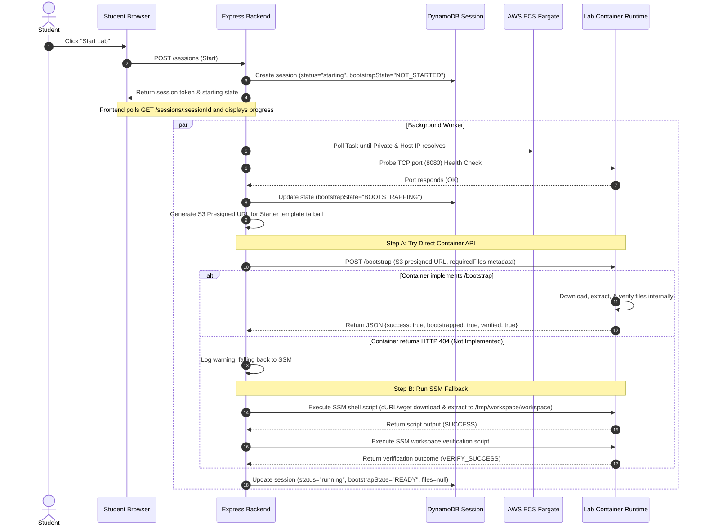

# Workspace Bootstrapping & File Operations Flow

This document details the lifecycle and runtime execution flows for workspace initialization, S3 template bootstrapping, file explorer listing, and file operations under the decoupled **Permanent Architecture**.

---

## 1. Session Initialization & Bootstrapping Flow

When a student launches a lab, the session moves through a backgrounded startup and verification lifecycle:



---

## 2. File Explorer & Listing Flow (`GET /files`)

Once the session is `running`, the File Explorer queries the backend for the directory tree structure. The backend operates as a proxy/orchestrator:

```mermaid
sequenceDiagram
    autonumber
    participant Frontend as Student IDE UI
    participant Backend as Express Backend
    participant DB as DynamoDB Session
    participant Container as Lab Container Runtime

    Frontend->>Backend: GET /files
    Backend->>DB: Fetch session details
    
    alt Cache Hit
        DB-->>Backend: Return cached session.files array
        Backend-->>Frontend: Return cached files list
    else Cache Miss
        Backend->>Backend: Check environment (ECS vs Local Mock)
        
        Note over Backend,Container: Step A: Try REST API GET /files
        Backend->>Container: GET /files
        
        alt Container implements /files
            Container-->>Backend: Return JSON array of file metadata
            Backend->>DB: Save list to session.files cache
            Backend-->>Frontend: Return files array
        else Container returns HTTP 404 (Not Implemented)
            Backend->>Backend: Log warning: falling back to SSM
            Note over Backend,Container: Step B: Run SSM Fallback
            Backend->>Container: Execute SSM Command writing python scan script via here-doc (cat << 'EOF')
            Note over Container: here-doc prevents string continuation syntax errors (\n)
            Container->>Container: Scan /tmp/workspace/workspace folder structure
            Container-->>Backend: Return stdout wrapped in ---FILES_START--- / ---FILES_END---
            Backend->>Backend: Extract & JSON.parse() file array
            Backend->>DB: Save list to session.files cache
        end
    end
    
    rect rgb(30, 40, 50)
        Note over Backend: Post-Processing File List
        Backend->>Backend: Filter out unnecessary files for .NET/MVC labs (obj/, bin/, wwwroot/lib/, config files, etc.)
    end
    Backend-->>Frontend: Return filtered files array
```



### .NET & MVC Explorer Filtering Rules
For `.NET` and `MVC` labs, the files list is post-processed in the backend to hide framework noise, keeping the flat file explorer focused strictly on active code files:
1. **Build Artifacts & Metadata**: Hidden paths include `obj/`, `bin/`, `Properties/`, `.vs/`, and `.idea/`.
2. **Vendor Libraries**: Large dependencies like `wwwroot/lib/` (jquery, bootstrap) and `favicon.ico` are filtered out, while student assets like `wwwroot/css/site.css` remain editable.
3. **Project & Package Configurations**: Hidden files include `.csproj`, `.sln`, `.user`, `.suo`, `.nuget.*`, `appsettings.json`, and `project.assets.json`.
4. **Helper/Layout Boilerplate**: Helper views like `_ViewStart.cshtml`, `_ViewImports.cshtml`, `_ValidationScriptsPartial.cshtml`, `license.txt`, and `.map` files are hidden.

---

## 3. File Actions Flow (Read, Write, Delete)

Individual file operations follow the same decoupled REST-first pattern, fallback to SSM using base64 encoding to prevent character loss or encoding syntax issues:

### A. Saving a File (`POST /save` or SSM Fallback)
1. **REST call**: Backend makes a `POST /save` request containing `{ path: filePath, content: content }` to the container.
2. **SSM Fallback**: If it returns `404`, the backend:
   - Converts content to Base64 in Node.js.
   - Sends a shell command to make parent directories and decode the block to target destination:
     ```sh
     mkdir -p "$(dirname "/tmp/workspace/workspace/...")"
     echo "<base64_string>" | base64 -d > "/tmp/workspace/workspace/..."
     ```

### B. Reading a File (`GET /file` or SSM Fallback)
1. **REST call**: Backend makes a `GET /file?path=...` request to the container.
2. **SSM Fallback**: If it returns `404`, the backend runs a shell reader:
   - Base64 encodes the file content inside the container shell and prints bounds (`###START###` / `###END###`).
   - Node.js reads the stdout, extracts the substring, decodes it back to UTF-8/buffer, and returns it.

### C. Deleting a File (`DELETE /file` or SSM Fallback)
1. **REST call**: Backend makes a `DELETE /file?path=...` request to the container.
2. **SSM Fallback**: If it returns `404`, it executes a simple shell command: `rm -f "/tmp/workspace/workspace/...""` via SSM execution.
